# Сборка робота

## Вам понадобится 

1. Картонная коробка ([Pappis из Икеи](assets/pappis-box-with-lid__0710998_PE727873_S5.jpg) подойдет)
2. Инструменты:
    - скальпель или канцелярский нож
    - карандаш
    - паяльник и припой (хороший паяльник с узким носиком, иначе будете страдать)
    - вольтметр ([у меня такой](https://aliexpress.ru/item/4000437047846.html))
    - много проводочков ([такие](assets/wires.jpg) подойдут; провода должны быть каждого типа и цвета: преимущественно красно-черные, немного разноцветных, а также типов in-out, in-in и out-out). 

    Сразу скажу: все соединения внутри сделаны путем вставления in-проводочков в out-контакты. Соблюдайте цветовую логичность проводочков, и изолентой сматывайте вместе схожие по назначению проводочки.

3. Компоненты:
    
    **На этом этапе нужно спаять первые соединения, чтобы подготовить периферию робота к установке. Делайте чтобы было как на картинке (или лучше)**

    1. Колёсная пара и моторы, и переключатель

        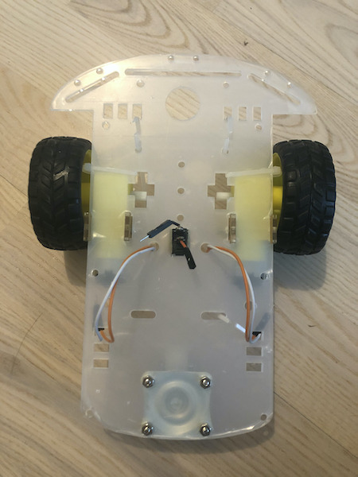
        
        Я использовал готовую. Точно продается в профильных магазинах.

        Обратите внимание на проводочки. После того как соберете шасси, нужно припаять 2 провода (+ и -) к контактам каждого мотора, и аккуратно вывести в дырки шасси.

        Также в комплекте у меня был (и, надеюсь, будет у вас) выключатель напряжения. Штука, тупо размыкающая цепь. К ней хорошо бы припаять кусочки провода (выход и вход), чтобы удобно было потом встраивать в цепь питания.

        [Пример >>](https://aliexpress.ru/item/32953806131.html)

    2. Сервопривод, чтобы крутить робо-рукой (правой)

        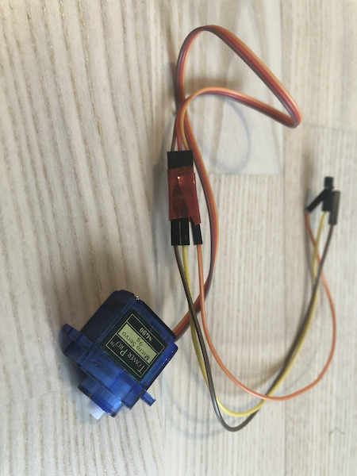

        Подойдет любой. Сила не важна, у меня самый слабый.
        
        Рекомендую подключить провода как на картинке - в выходы сервопривода воткнуть out-контакт, а out-половинки уже надевать на пины GPIO на Raspberry.

        [Пример >>](https://aliexpress.ru/i/32946393109.html)

    3. Raspberry Pi 2+ и камера

        

        RPI - любая модель начиная с 2 (требования из-за плагина pigpio, которым осуществляется ШИМ-контроль).
        
        Камера - в целом, тоже любая. Качественное кино показывать все равно нет смысла, так что любая VGA подойдет, главное, чтобы CSI-интерфейс был (шлейф короче).

        [Пример RPI >>](https://aliexpress.ru/item/32623151958.html)
        [Пример камера >>](https://aliexpress.ru/item/32913316415.html)

    4. Драйвер моторов

        

        Нужно как-то крутить те DC-моторы. Для этого применяют либо отдельные чипы для контроля напряжения (insane mode, я так не умею), либо готовое решение для хлебушков - уже собранная плата-драйвер. У нас 2 колеса на платформе, так что подойдет плата с двумя выходами на моторы.

        Я уже подключил провода, можете сделать прям как на картинке, будет проще потом. Провода необходимо использовать типа in-in. 

        [Пример >>](https://aliexpress.ru/item/32994608743.html)

    5. Понижающие преобразователи постоянного тока

        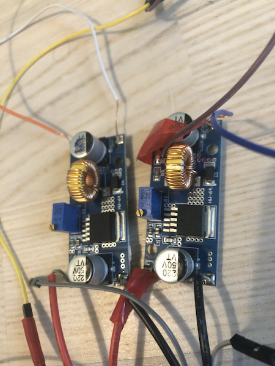

        Нам для работы понадобится 3 штуки: 
        - 1 для преобразования из 19 вольт блока питания в 16,8 вольта зарядного тока
        - 1 для преобразования 11-16,8 вольт выходного из батарей тока в 5 вольт для Raspberry Pi
        - 1 для преобразования 11-16,8 вольт выходного из батарей тока в 10 вольт для драйвера моторов L298N

        Подойдет любой, у которого входной диапазон в пределах 10-20 вольт, а выходной в пределах 5-20. Диапазон может быть шире. У моих было 5-35 (вход) / 4-30 (выход).

        [Пример >>](https://aliexpress.ru/item/1084552308.html)

     6. Суровые траймвайные клеммники

        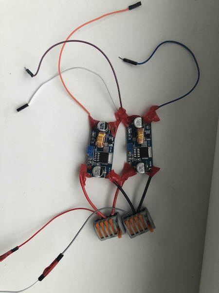

        Использоваться будут как на картинке. Нужно минимум 5 входов. Если у вас есть другие решения, вообще не проблема. Клеммники это все что смог найти за 10 минут мой кот, когда я его попросил.

        Это будет главное место, откуда на всё остальное устройство будет подаваться ток. В клеммы входят провода с BMS-платы (считай, с батарей), выходят на преобразователи. Есть еще по проводу для зарядки (на картинке уходят в низ кадра).

        [Пример >>](https://aliexpress.ru/item/32846980682.html)

     7. 4 аккумуляторные батареи формата 18500, и кейс (или 2 кейса на 2 штуки)

        

        Я использую Littokala 3700 mAh, потому что они выглядят понадежнее прочих. Тем не менее, все производители аккумуляторов лгут о ёмкости. Но где-то на 2300-2500 при написанных 3700 можно рассчитывать.

        Батареи должны продаваться заряженными процентов на 70. Для старта этого хватит. Проверьте, и если они менее 30%, то лучше придумать как зарядить.

        [Пример >>](https://aliexpress.ru/item/32846348901.html)
     
     8. BMS-плата (плата балансировки / плата контроля заряда)

        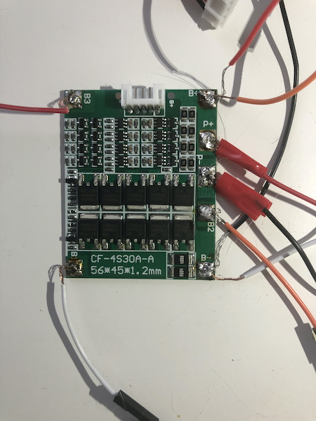

        Нунжа чтобы, с одной стороны, батареи, соединенные последовательно, разряжались равномерно, а с другой - чтобы равномерно заряжались, когда подключаешь зарядку. Я за экологию, поэтому никаких батареек :)

        Как видно на изображении, я Леонардо Давинчи от мира пайки. Постарайтесь поаккуратнее. 

        Вкратце расскажу, как паять:
        1. Нужно соединить батареи последовательно "змейкой" (см. фото АКБ)
        2. Согласно инструкции BMS-платы (у меня CF-4S30A) нужно соединить начало каждой новой батареи с соответствующим контактом BMS-платы (у моей платы 2 режима: через "фирменные" проводочки либо сам припаивай к указанным контактам B1, B2 ...), а затем вывести P+ и P- - контакты на заряд-разряд.
        3. Т.к. я использую фирменные проводочки, свободные контакты (B1, B2 и B3) я использую для индикатора заряда батареи. Поэтому на каждый из нумерованных контактов припаиваем по одному контакту (как видите, я использую разъемы проводочков - режу пополам и получаю провод с разъемным соединением в середие и одного цвета). Также припаиваем дополнительные контакты к B+ и B-, потому что это будет оставшиеся 2 из 5 проводов, необходимых индикатору напряжения. Не припаивайте слишком длинные провода, будет мешать.

        (Еще у меня зачем-то припаяни лишние провода к B+ и B-, если вы юзаете пятерку проводов через белый фирменный штекер, то вам не надо так делать)

        [Пример >>](https://aliexpress.ru/i/32823806861.html)

    9. Индикатор заряда батареи

        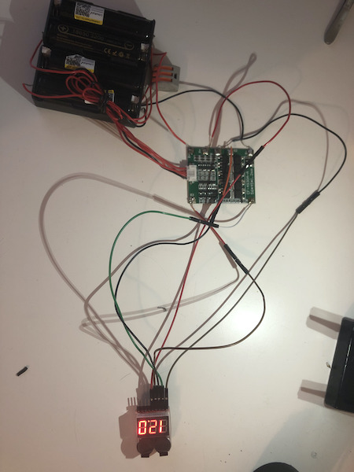

        На картинке внизу. Имеет 5 входов, слева направо (на картинке перевернут, так что относительно вас справа налево):
        0 - главный минус батареи (B-)
        1 - первая АКБ (B1)
        2 - вторая АКБ (B2)
        3 - третья АКБ (B3)
        4 - по идее, должна быть четвертая АКБ, но она чудесным образом совпадает с главным плюсом нашей батареи, так что B+.

        Если постараетесь, сможете разобраться в аду проводов на картинке.
        - от батарейного отсека к плате идет 5 проводов (у меня 7, 2 лишних)
        - от платы идут 2 выхода на периферию (P+ и P-) и 5 выходов на индикатор (B-, B1, B2, B3, B+)
        
        Втыкаем 5 проводочков в 8S-индикатор батареи и наблюдаем вольтаж. Профит. Потом вынимаем и кладем отдельно до сбора всего робота.

        [Пример >>](https://aliexpress.ru/item/33012058398.html)


    10. Универсальное зарядное устройство для ноутбуков

        Понадобится, чтобы сделать из него зарядник для робота.
        Единственное требование - чтобы мог выдавать 17-19 вольт. Вам потребуется переделать выходные контакты зарядника, чтобы они подходили к нашим проводочкам.

        [Пример >>](https://aliexpress.ru/item/33002563321.html)


## Сборка

1. Делаем корпус
    
    Для корпуса хорошо подойдет картон. Я использую икеевский картонный ящик Pappis, вы можете что угодно. Индустриальные надписи на бортах придадут роботу невыразивый DIY-респект.
    
    1. Режем коробку на развертку
    
        

        Ширина основания - 10,5 см, длина основания - 20,5 см. Высота - 8 см.
        На вашей развертке должен получиться разложенный на стороны параллелепипед с "ушками" для закрепления. "Ушки" достаточно сделать на боковинах корпуса.

    2. Сгибаем коробку

        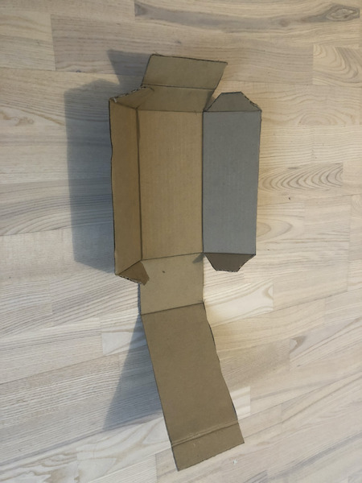

        Всё просто, кладешь линкейку и сгибаешь. Не помните картон там где он гнуться не должен.

    3. Делаем дырки

        Нужно сделать дырки:
        - [2 штуки в каждом "ушке"](assets/IMG_3457.jpg) и 2 штуки в том месте, на которое "ушко" накладывается
        - [под крепление картонного корпуса на шасси (8 дырок) и выключатель](assets/IMG_0997.jpg)
        - [под камеру спереди](assets/IMG_6941.jpg) - круглая в центре, 4 небольшие по углам под крепление камеры
        - [под индикатор батареи сзади](assets/IMG_9045.jpg), и 4 дырки под крепление индикатора
        - в правой части корпуса [сложную дырку под сервопривод руки](assets/IMG_6020.jpg), и 2 дырки по бокам под крепление (лучше рассмотрите, как выглядит привод)
        - 2 небольшие дырки под зарядные провода

        В будущем как крепление я использую проволочки, которыми проводочки сматывают в электронике. Божественно удобно и ублюдочно-некрасиво. То что надо.

    4. Скрепляем корпус

        

        Должно получиться примерно вот так. Для соединения частей корпуса я использовал черные хомуты. Усики отрезаем.

    5. Закрепляем корпус на шасси

        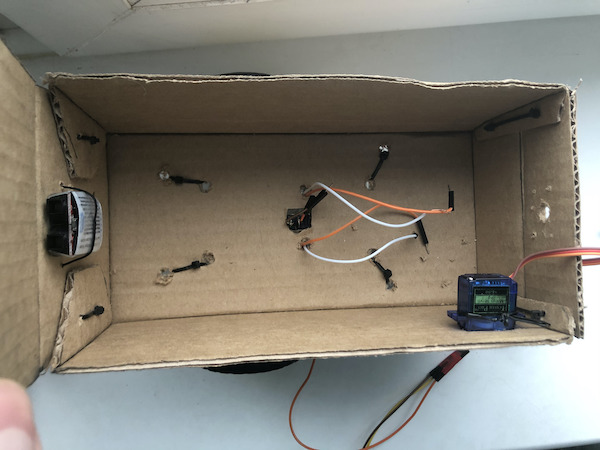

        (Не обращайте внимания что на фото немного больше периферии вставлено, мы к этому еще придем)

        1. Поставьте коробку на шасси
        2. Просуньте проводочки от контактов моторов в подходящие дырки
        3. Просуньте проводочки от выключателя в центральную дырку

        Держите в уме, что камера должна смотреть в ту же сторону, куда и третье колесо (иначе робот будет кошмарно плохо рулиться).

    6. Вставляем сервопривод и индикатор

        
        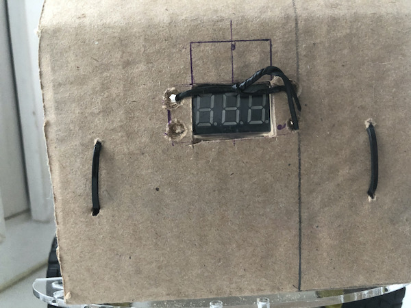

        Индикатор приматываем проволокой. Завязываем снаружи корпуса. Аналогично с сервоприводом. Привод должен прилегать сильно, иначе отпадет во время колебаний.

    7. Устанавливаем Raspberry и камеру

        

        Вкладываем RPI в корпус как показано. Если болтается, можно уплотнить кусочками сургуча (или обрезков картона, которые точно остались). Лучше уплотнить, потому что люфт это от лукавого.

        Камеру нужно просунуть в дырку, и 4 крепежных отверстия попарно соединить волшебными проволочками. Следите за тем, чтобы давление на сам видеочип было несильным, а то он очень легко отваливается. Потом можно обратно поставить, но нужно отсоединять камеру, а это морока.

        

    8. Устанавливаем батарейный блок

        

        Для удобства я сделал перегородку из картона. Советую (должна быть слегка скошенная трапеция).

        Сначала батареи, потом BMS-плата, потом проводочки, ведущие в индикатор либо P+ и P-, ведущие к распределительным клеммникам (возможно, индикатор придется снять - места маловато).

        P- втыкайте сначала в выключатель, а свободный второй конец в будущем воткнем в распределительные клеммники.

    9. Устанавливаем клеммники и преобразователи

        

        Стоит закрыть батарейный отсек крышечкой, станет попросторнее.
        В пространство перед отсеком кладем два клеммника. Плюсовой провод от батарейного отсека втыкаем в зажим положительного клеммника. Минусовой провод (который у нас уже пропущен через выключатель, а выключатель в положении ВЫКЛ) втыкаем в минусовой разъем клеммника. Укладываем всё аккуратненько. Пока что не втыкаем контакты кажого преобразователя в соответствующие устройства.

        На картинке драйвер моторов просто лежит, еще не подключен.

    10. Подключаем драйвер моторов

        1. Подключаем драйвер моторов к контактам 10-вольтового клеммника
            
            Что важно: должна быть УСТАНОВЛЕНА перемычка (рассмотрите фото на алиэкспрессе, чтобы увидеть перемычку). Перемычка сигнализирует драйверу моторов, что нужно брать питание с внешнего, более высоковольтного контура, а не от 5-вольтового с повышением. Если перемычку снять, драйвер моторов сломается.

            Три синие контакта: внешнее питание | земля | 5-вольтовый контакт
            Мы подключаем + от 10-вольтового клеммника к левому контакту внешнего питания, - от 10-вольтового клеммника к контакту земля.

        2. Подключаем контакты моторов к драйверу моторов
            
            Подключайте вот так:
            ```
            белый       оранжевый
            оранжевый   белый
            ```
            Это если ориентация платы "контактами питания вниз".

            (На фото неправильно подключено, я тогда еще не знал что нумерация идет 1-4-3-2, а не 1-3-2-4)

            

    11. Подключаем GPIO-контакты на Raspberry Pi

        Будет три шага: контакты питания самой Raspberry Pi, контакты драйвера моторов и контакты сервопривода.

        Но сначала взгляните на схему GPIO-контактов Raspberry Pi:

        

        Существует два способа именовать контакты RPI: по их порядковому номеру и по их номерам, выданным безупречно логичными разработчиками Raspberry. Мы будем использовать второй, потому что он более распространен в ПО.

        То есть, например, ШИМ-модуляцию для сервопривода будет создавать для нас GPIO12, он же пин номер 32.

        1. Контакты питания Raspberry Pi

            Нужно от пятивольтового клеммника положительный контакт воткнуть в любой пятивольтовый пин. Подойдет номер 4.
            Отрицательный контакт нужно воткнуть в Ground-пин, подойдет номер 6.

            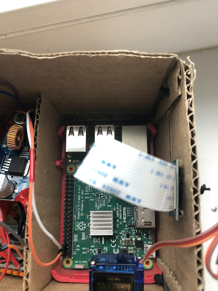

        2. Контакты драйвера моторов

            У драйвера 6 контактов. Первые 3 отвечают за левое колесо, вторые 3 за правое.

            Первые три контакта последовательно втыкаем в пины: GPIO17, GPIO27, GPIO22.

            Вторые три втыкаем в GPIO16, GPIO20, GPIO21.

            Должно быть как тут:

            

        3. Контакты сервопривода

            У привода 3 контакта: +, - и ШИМ (широтно-импульсная модуляция).

            Положительный втыкаем в пин номер 2 (5-вольтовый), отрицальный втыкаем в номер 9 (Groud), а ШИМ-пин втыкаем в GPIO12.

            

    12. Пробный запуск

        Молимся, крестимся, щуримся, нажимаем на кнопку включения. Должны аккуратно загореться лампочки, и, самое главное, должен заморгать красным и зеленым диод на RPI.

    13. Делаем зарядное устройство

        1. Возьмите самый широкий сменный наконечник зарядного устройства, разломайте его, чтобы добраться до контактов, и припаяйте к ним наши проводочки. Чтобы правильно выбрать цвет проводов - красный или черный, воспользуйтесь вольтметром. Чаще положительный контакт в центре, а отрицательный снаружи. Когда припаяете, смотайте все изолетной, чтобы исключить болтание в точке припоя.

            
            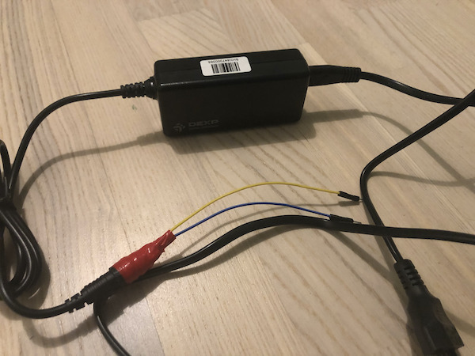

        2. Возьмите 3-й (из 3-х) понижающий преобразователь постоянного тока, припаяйте ко входам 2 in-проводочка, а к выходам 2 out-проводочка. Во входы вставляйте 2 контакта с зарядного устройства (проверьте полярность!!!), а потом включайте в сеть. На выходных контактах померяйте напряжение и крутите ручку, пока не станет 16,8. Выставьте 16,8, таким напряжением будем заряжать наш батарейный блок.

    14. Кто-нибудь, дайте этому роботу руку

        Хорошо подойдет деревянная палочка и изолента.

        

    15. Фиксатор крышки

        Короче две дырочки и палочка, с одной стороны палочки проволочка-фиксатор.

        

**Готово.**