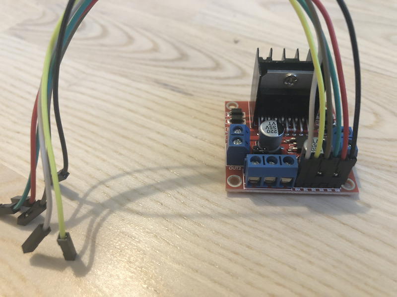
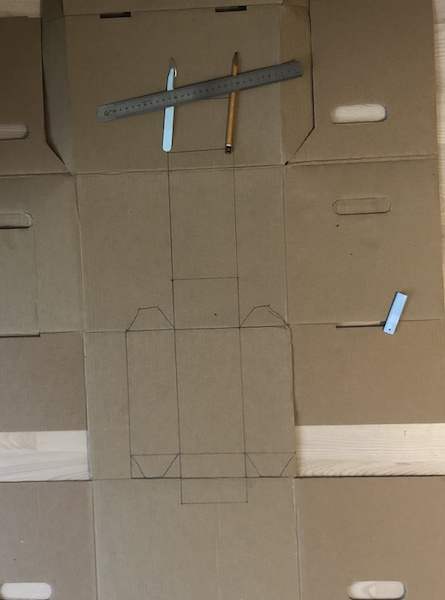
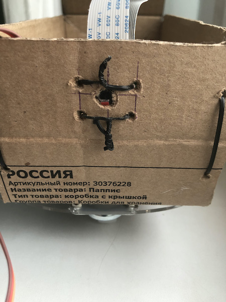
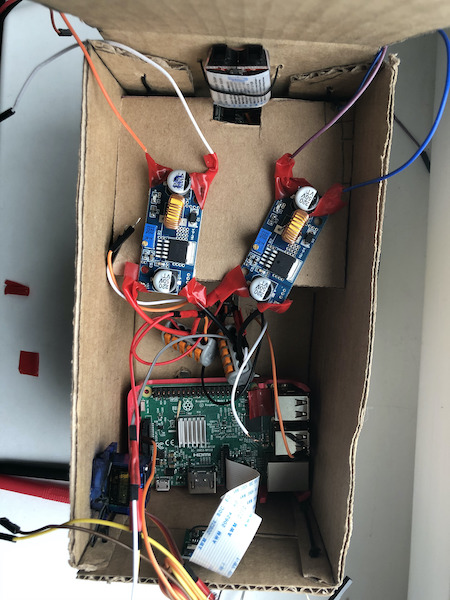
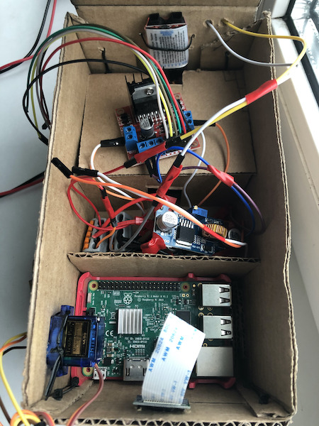
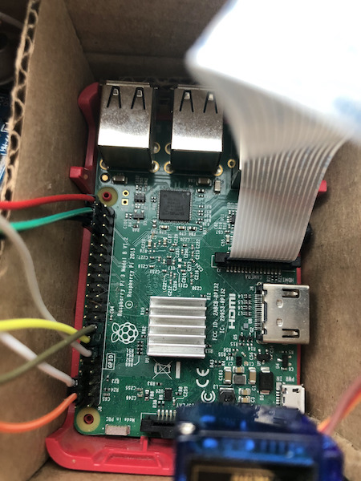

# Robot assembly

## You will need

1. A carton box ([Pappis from Ikea](assets/pappis-box-with-lid__0710998_PE727873_S5.jpg) is ok)
2. The tools:
    - a sharp paper knife or a scalpel
    - a pencil
    - a soldering iron and some solder (get a nice soldering iron with a thin point)
    - a voltmeter ([I have this one](https://aliexpress.ru/item/4000437047846.html))
    - a plenty of small wires ([these](assets/wires.jpg) are ok; the wires should be of every type and color: mostly red and black, some should be of every color, and the wire types should be both in-out, in-in and out-out.

    Worth noting: all the connections inside are made by plugging in the out-wires to the in-contacts. Follow the color order of the wires and bind together the wires with the common function.

3. The components:
    
    **You have to solder the first connections on this stage to prepare the robot peripherials for the installation. Do as in the photos (or better)**
    **На этом этапе нужно спаять первые соединения, чтобы подготовить периферию робота к установке. Делайте чтобы было как на картинке (или лучше)**

    1. The chassis, motors and the switch

        
        
        I am using the prefab one. It has to be in the specialized shops.

        Take a look at the wires. Having assembled the chassis, you now have to solder two wires (+ and -) to the contacts of each motor, and then carefully put the wires through the chassis holes.

        I had a switch shipped as well (and I hope you will have also). The thing just to open the circuit. Now you should solder small wire parts (with the in and out ends) to embed it to the whole scheme more easily.

        [Example >>](https://aliexpress.ru/item/32953806131.html)

    2. The servo drive to move the robo-hand (right)

        

        Just any should fit. The power does not matter, mine is the weakest.
        
        I recommend to connect the wires as shown - connect the in-out wires to the servo contancts, and then puth the out ends to the GPIO pins on the Raspberry.

        [Example >>](https://aliexpress.ru/i/32946393109.html)

    3. Raspberry Pi 2+ and the camera

        

        RPI: any model older than the first should be fine (it depends on the pigpio js plugin which is used to create the PWM).
        
        Camera: any as well. There is no point in HD picture, so any VGA-capable camera is enough. The only necessary thing is the CSI interface.

        [RPI example >>](https://aliexpress.ru/item/32623151958.html)
        [Camera example >>](https://aliexpress.ru/item/32913316415.html)

    4. The motor driver board

        

        We have to run the DC motors somehow. The one way is to run them with the special small chips for the DC control (that's too hard). The other way is to use some prebuilt options like the motor driver board. There are two wheels on our chassis, so L298N with two motors output is just ok.

        As you see, I've already plugged in all the wires. You can do as shown, that's gonna help later. You should use in-in wires.

        [Example >>](https://aliexpress.ru/item/32994608743.html)

    5. Step-down DC/DC converters

        

        We will need 3 of them:
        - to convert 19 volts from the universal power supply to 16,8 volts of charging current
        - to convert 11-16,8 volts of batteries current to 5 volts for RPI
        - to convert 11-16,8 volts of batteries current to 10 volts for the motor driver board

        Almost any step-down coverter can fit. It just has to have the input range within 10-20 volts and the output range within 5-20 volts. Mine had 5-35 input and 4-30 output volts.

        [Example >>](https://aliexpress.ru/item/1084552308.html)

     6. A harsh tramway wire terminal

        

        It is gonna be used as shown. It has to have at least five slots. But in case if you have another way to solve the current split problem, feel free to do as you want. These terminals are the only thing that came to my mind in 10 minuts (I asked my cat).

        The terminals are gonna be the main spot from where the rest of the peripherials are gonna be powered. The BMS board gives the power to the terminals through the positive and negative wires, and then the terminals give the power to the converters. And also there are to wires (one for each terminal) for the charging.

        [Example >>](https://aliexpress.ru/item/32846980682.html)

     7. 4 rechargeable 18500 batteries and the case (or two small cases)

        

        I use Liitokala 3700 mAh because they look slightly better than the others. Anyway, all the batteries manufacturers provide wrong data about the real batteries capacity. You can surely get 2300-2500 mAh when it's said to have 3700.

        The batteries are usually sold with 70% charge. It's enough for the first launches. If it's less than 30%, it's better to charge the batteries somehow.

        [Example >>](https://aliexpress.ru/item/32846348901.html)
     
     8. BMS board (balancing board / charge control board)

        

        It's needed to charge and dischardge batteries equally. I'm trying to be eco-friendly, so no non-chargeable batteries are allowed :)

        As you can see on the image, I'm at least Leonardo da Vinci in soldering. Try to do it better.

        Shortly, how to solder the elements:
        1. You should connect the batteries consequently, like a "snake" (consider the photo)
        2. According to the BMS board manual (mine is CF-4S30A), you have to connect the start of every new battery with the relevant BMS board contact. (Mine has two ways of connection: with the special white wire block or manual way with the contacts B1, B2 etc.) Then you have to solder two wires to the P+ and P- contacts for the charge and discharge.
        3. Since I'm using the small wires block, free special contacts are gonna be used for the batteries charge level indicator. So we should solder one wire (with the "in" end) to each special contact (B1, B2 etc.). Finally, we should solder two additional wires to the B+ and B- contacts, because these are first and 5-th contacts among the indicator pins. (B1 is 2nd, B2 is 3rd, B3 is 4th)

        (Also I somehow left soldered two redundant wires to the contacts B+ and B-. So if you are using the small wire block, you should have only one wire on B+ and B-)

        [Example >>](https://aliexpress.ru/i/32823806861.html)

    9. Battery charge level indicator

        

        It's in the bottom of the image. It has 5 inputs, from left to right (it's upside down on the image, so it's from right to left for you):

        0 - main negative contact (B-)
        
        1 - the first battery (B1)
        
        2 - the second battery (B2)
        
        3 - the third battery (B3)
        
        4 - basically, it has to be the fourth battery, but it at the same time is the main positive contact, so it's B+

        If you try really hard, you'll sort things out in this wire hell on the image.

        - there are 5 wires from battery block going to the BMS board (it's 7 on the image, because 2 of them are redundant)
        - there are 2 outputs to the wire terminals and then to peripherials (P+ and P-) and 5 outputs for the battery indicator (B-, B1, B2, B3, B+)

        You should plug in 5 wires from the BMS board to the 8S indicator and check the voltage. Then plug them out and let it be there until the whole robot starts being assembled.

        [Example >>](https://aliexpress.ru/item/33012058398.html)


    10. Universal notebook charger

        It's needed to make a charger for the robot.
        The only requirement is the ability to give 17-19 volts output. You have to rebuild the output contacts of the charger to fit to our in-wires (going from the wire terminals).

        [Example >>](https://aliexpress.ru/item/33002563321.html)


## Assembly

1. Making the case
    
    The carton is good for the case. I use the Ikea's carton box Pappis, and you're free to use any carton you'll find. The industrial inscriptions will make the robot look more DIY-ish.
    
    1. Cutting the carton for the projection
    
        

        The width of the box is 105 millimeters, the length is 205 mm. The height of the box is 80 mm. The result should look like the opened box with "ears" for the fixation. The "ears" should be on the side parts only.

    2. Bending the box

        

        It's easy, just put down the ruler and bend along it. Try not to crush the carton where it doesn't have to be bent.

    3. Making holes

        We have to make the holes:
        - [2 holes in each "ear"](assets/IMG_3457.jpg) and 2 holes in the place where the "ear" is attached to
        - [8 holes to attach the carton case to the chassis, and for the switch](assets/IMG_0997.jpg)
        - [for the camera in the front side](assets/IMG_6941.jpg) - round in the center, and 4 small holes in the corners for the camera mounts
        - [for the battery indicator in the tail](assets/IMG_9045.jpg), and also 4 holes for the indicator mounts
        - in the right part of the case [a complicated hole for the servo drive](assets/IMG_6020.jpg), and two holes by the sides of it for the mounts (you should better take a look at how it's done on the image)
        - two small holes in the tail for the charging wires

        I'll use black mounting wires usually used to bind cables in the newly shipped devices to attach the peripherials to the case. It's simple and ugly enough.

    4. Fixing the case

        

        It should look like this in the end. I used small black clamps to attach the case parts. And then I cut off the rest of the clamps.

    5. Attaching the case to the chassis

        

        (Never mind the amount of peripherials is more than it's supposed to be according to this guide; we'll get there later)

        1. Put the case on the chassis
        2. Push the wires from the motors to the relevant holes
        3. Push the wires from the switch to the biggest hole
        
        Keep in mind that the camera has to be faced to the same as as the third (small) wheel. Otherwise the robot is not going to be controlled well.

    6. Connecting the servo and the battery indicator

        
        

        Now let's attach the indicator with the black mounting wire. Tie the wires outside the box. The same with the servo. The servo drive should be really tightened because it will fall of during the wild ride.

    7. Installing the Raspberry Pi and the camera

        

        Put the RPI to the case as shown. If it's too loose, then put some carton pieces at between it and the case wall. It's really better to fix the Pi board.

        Then you should push the camera through the camera hole, and fix it with black mounting wires. Be sure not to put too much pressure to the small video chip on the camera board, since it is really easy do detach. You can put it back, but you'll have to disassemble the part of the robot.

        

    8. Installing the battery block

        

        I made a separator from the piece of carton to make it more comfortable to keep all the parts inside. It should look like a slightly beveled trapeze.

        First come the batteries, then the BMS board, then all the wires leading to the indicator (probably you'll have to take it off to put on all the battery wires) and the power contacts (P+ and P-). The power contacts should be put inside the wire terminals (according to the polarity).
        
        P- contact should go to the switch, and the free end in the future would be put inside the wire terminal. P+ contact goes straight to the terminal.

    9. Устанавливаем клеммники и преобразователи

        

        Стоит закрыть батарейный отсек крышечкой, станет попросторнее.
        В пространство перед отсеком кладем два клеммника. Плюсовой провод от батарейного отсека втыкаем в зажим положительного клеммника. Минусовой провод (который у нас уже пропущен через выключатель, а выключатель в положении ВЫКЛ) втыкаем в минусовой разъем клеммника. Укладываем всё аккуратненько. Пока что не втыкаем контакты кажого преобразователя в соответствующие устройства.

        На картинке драйвер моторов просто лежит, еще не подключен.

    10. Подключаем драйвер моторов

        1. Подключаем драйвер моторов к контактам 10-вольтового клеммника
            
            Что важно: должна быть УСТАНОВЛЕНА перемычка (рассмотрите фото на алиэкспрессе, чтобы увидеть перемычку). Перемычка сигнализирует драйверу моторов, что нужно брать питание с внешнего, более высоковольтного контура, а не от 5-вольтового с повышением. Если перемычку снять, драйвер моторов сломается.

            Три синие контакта: внешнее питание | земля | 5-вольтовый контакт
            Мы подключаем + от 10-вольтового клеммника к левому контакту внешнего питания, - от 10-вольтового клеммника к контакту земля.

        2. Подключаем контакты моторов к драйверу моторов
            
            Подключайте вот так:
            ```
            белый       оранжевый
            оранжевый   белый
            ```
            Это если ориентация платы "контактами питания вниз".

            (На фото неправильно подключено, я тогда еще не знал что нумерация идет 1-4-3-2, а не 1-3-2-4)

            

    11. Подключаем GPIO-контакты на Raspberry Pi

        Будет три шага: контакты питания самой Raspberry Pi, контакты драйвера моторов и контакты сервопривода.

        Но сначала взгляните на схему GPIO-контактов Raspberry Pi:

        

        Существует два способа именовать контакты RPI: по их порядковому номеру и по их номерам, выданным безупречно логичными разработчиками Raspberry. Мы будем использовать второй, потому что он более распространен в ПО.

        То есть, например, ШИМ-модуляцию для сервопривода будет создавать для нас GPIO12, он же пин номер 32.

        1. Контакты питания Raspberry Pi

            Нужно от пятивольтового клеммника положительный контакт воткнуть в любой пятивольтовый пин. Подойдет номер 4.
            Отрицательный контакт нужно воткнуть в Ground-пин, подойдет номер 6.

            

        2. Контакты драйвера моторов

            У драйвера 6 контактов. Первые 3 отвечают за левое колесо, вторые 3 за правое.

            Первые три контакта последовательно втыкаем в пины: GPIO17, GPIO27, GPIO22.

            Вторые три втыкаем в GPIO16, GPIO20, GPIO21.

            Должно быть как тут:

            

        3. Контакты сервопривода

            У привода 3 контакта: +, - и ШИМ (широтно-импульсная модуляция).

            Положительный втыкаем в пин номер 2 (5-вольтовый), отрицальный втыкаем в номер 9 (Groud), а ШИМ-пин втыкаем в GPIO12.

            

    12. Пробный запуск

        Молимся, крестимся, щуримся, нажимаем на кнопку включения. Должны аккуратно загореться лампочки, и, самое главное, должен заморгать красным и зеленым диод на RPI.

    13. Делаем зарядное устройство

        1. Возьмите самый широкий сменный наконечник зарядного устройства, разломайте его, чтобы добраться до контактов, и припаяйте к ним наши проводочки. Чтобы правильно выбрать цвет проводов - красный или черный, воспользуйтесь вольтметром. Чаще положительный контакт в центре, а отрицательный снаружи. Когда припаяете, смотайте все изолетной, чтобы исключить болтание в точке припоя.

            
            

        2. Возьмите 3-й (из 3-х) понижающий преобразователь постоянного тока, припаяйте ко входам 2 in-проводочка, а к выходам 2 out-проводочка. Во входы вставляйте 2 контакта с зарядного устройства (проверьте полярность!!!), а потом включайте в сеть. На выходных контактах померяйте напряжение и крутите ручку, пока не станет 16,8. Выставьте 16,8, таким напряжением будем заряжать наш батарейный блок.

    14. Кто-нибудь, дайте этому роботу руку

        Хорошо подойдет деревянная палочка и изолента.

        

    15. Фиксатор крышки

        Короче две дырочки и палочка, с одной стороны палочки проволочка-фиксатор.

        

**Готово.**